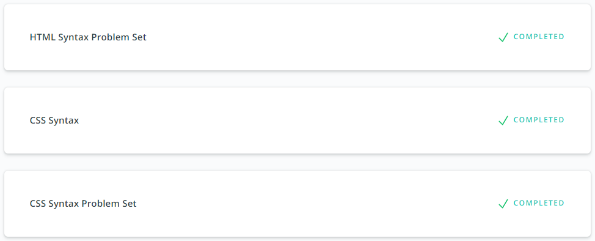
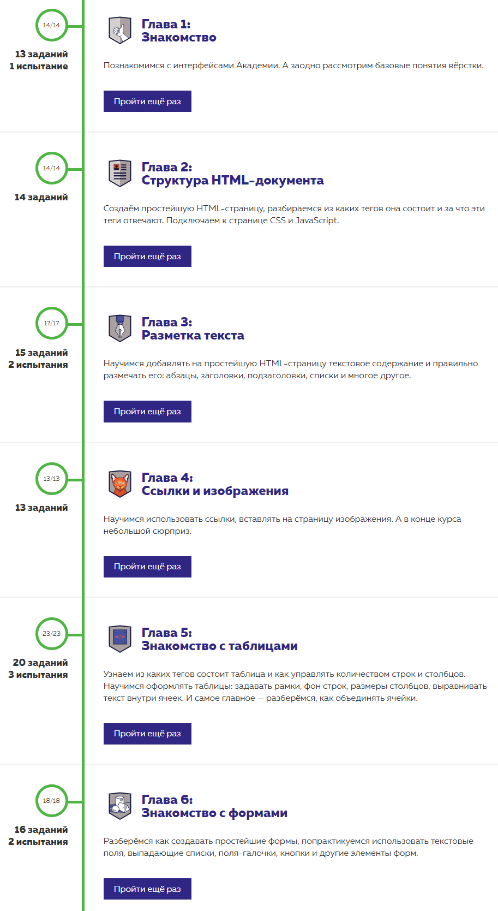
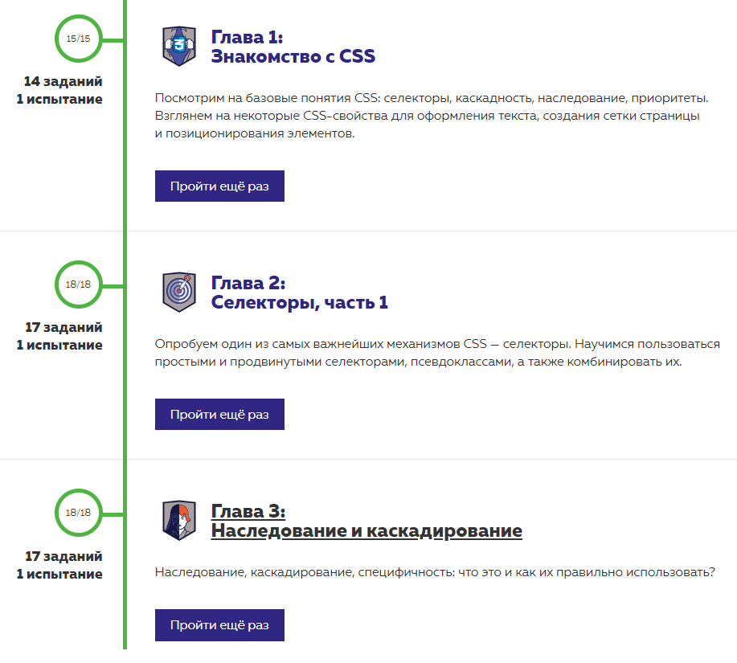
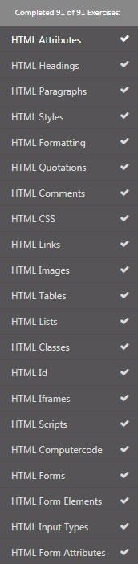

## Intro to HTML and CSS
Watched and completed materials:
⋅⋅*Udacity [Intro to HTML and CSS](https://classroom.udacity.com/courses/ud001)

⋅⋅*htmlacademy [Основы HTML](https://htmlacademy.ru/courses/basic-html)

⋅⋅*htmlacademy [Основы CSS](https://htmlacademy.ru/courses/basic-css)

⋅⋅*w3school [HTML CSS](https://www.w3schools.com/html/exercise.asp)

[back](../README.md)
