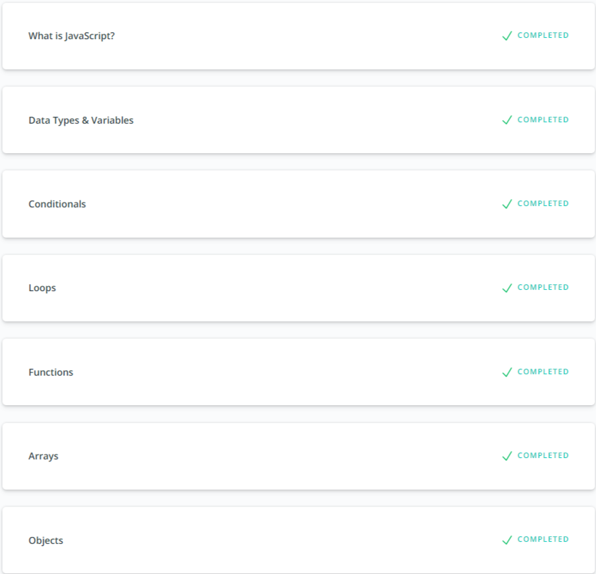
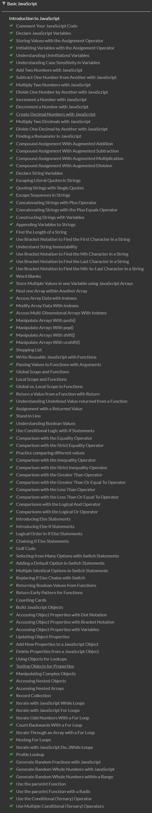
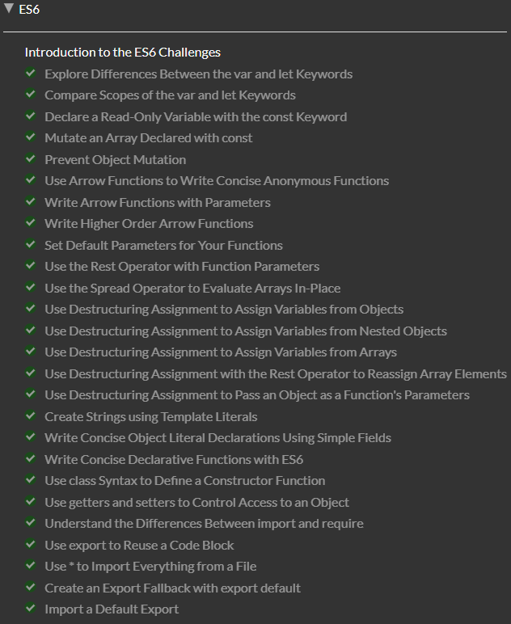
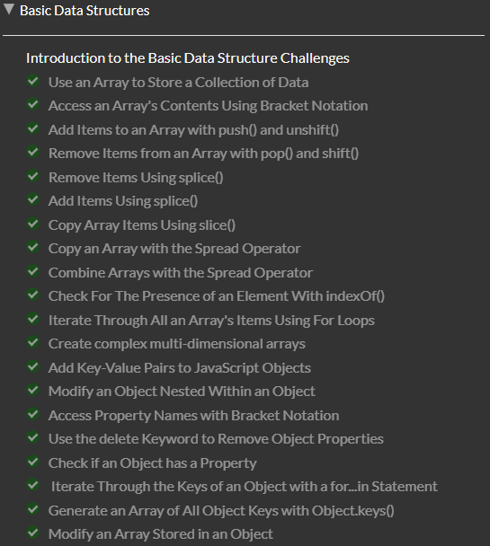
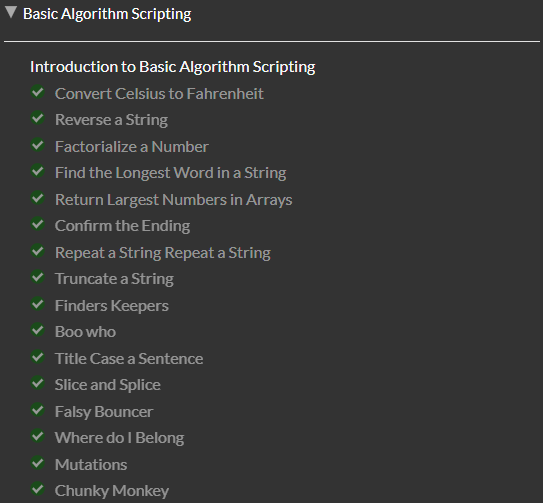
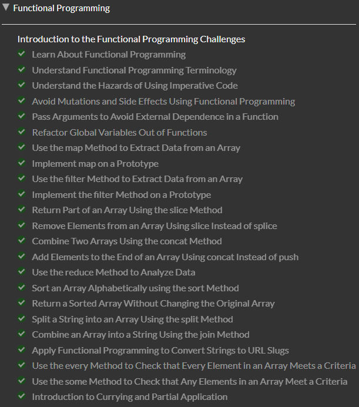
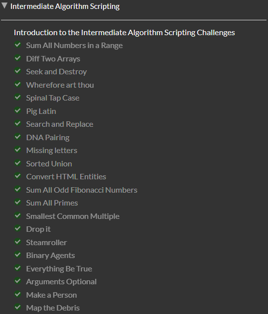

## JS Basics

* [Intro to JavaScript](https://classroom.udacity.com/courses/ud803)

* [Basic JavaScript](https://learn.freecodecamp.org/javascript-algorithms-and-data-structures/basic-javascript/)

* [ES6 Challenges](https://learn.freecodecamp.org/javascript-algorithms-and-data-structures/es6/)

* [Basic Data Structures](https://learn.freecodecamp.org/javascript-algorithms-and-data-structures/basic-data-structures/)

* [Basic Algorithm Scripting](https://learn.freecodecamp.org/javascript-algorithms-and-data-structures/basic-algorithm-scripting/)

* [Functional Programming](https://learn.freecodecamp.org/javascript-algorithms-and-data-structures/functional-programming/)

* [Algorithm Scripting Challenges](https://learn.freecodecamp.org/javascript-algorithms-and-data-structures/intermediate-algorithm-scripting)

[back](../README.md)

