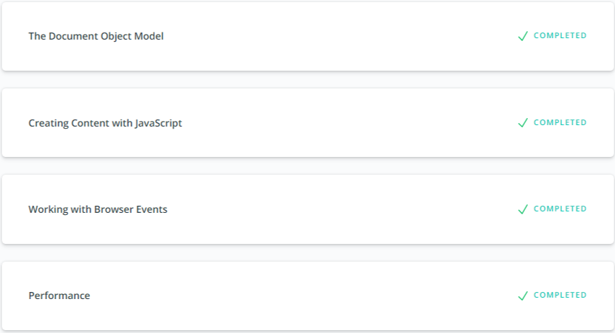
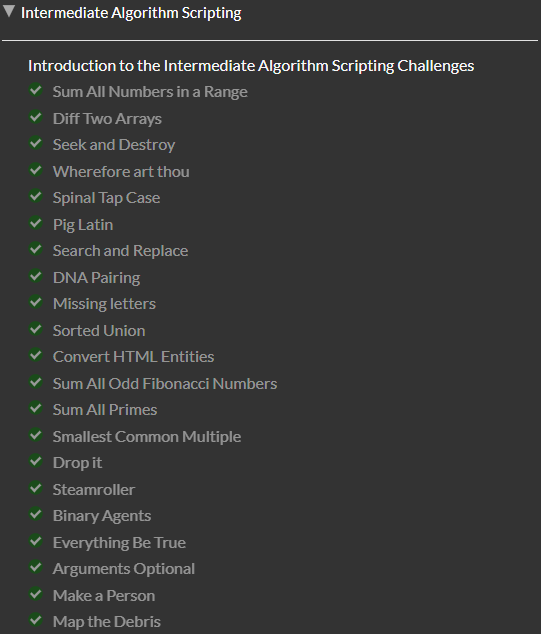

## DOM

* [JavaScript and the DOM](https://classroom.udacity.com/courses/ud117)

* [freecodecamp Algorithm Scripting Challenges](https://learn.freecodecamp.org/javascript-algorithms-and-data-structures/intermediate-algorithm-scripting/)

[back](../README.md)
