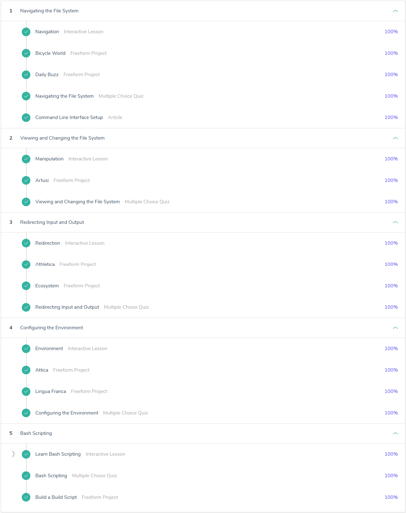
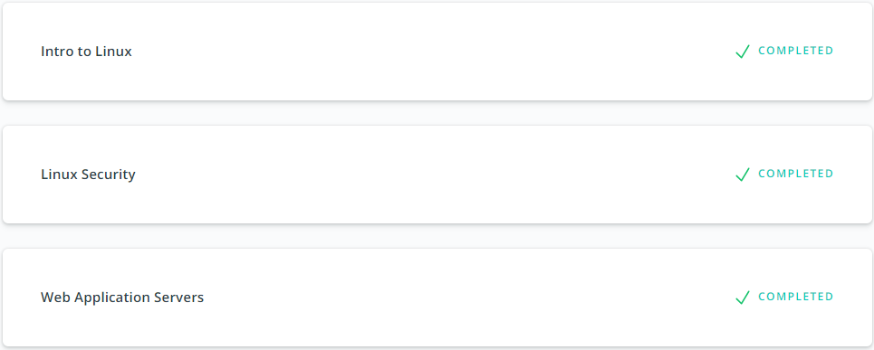
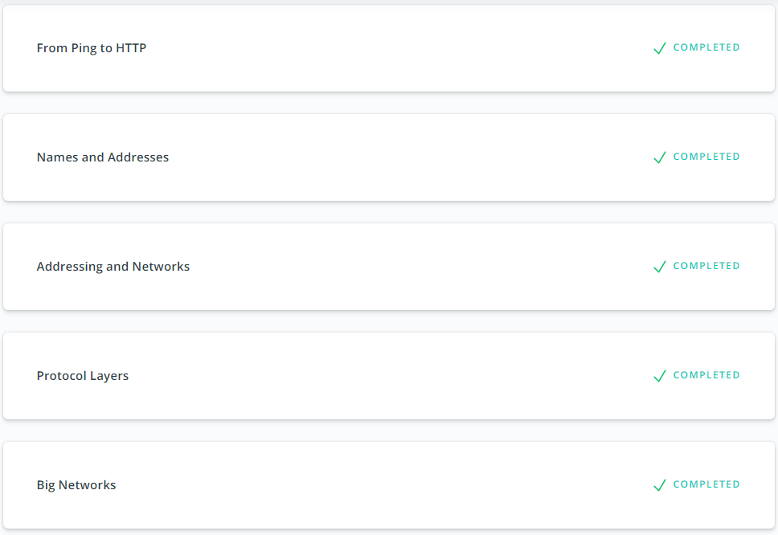

## Linux CLI, and HTTP
Learned simple commands and bash scripting for working in Linux.
Read and learned information about the HTTP protocol.
* [Learn the Command Line](https://www.codecademy.com/learn/learn-the-command-line)

* [Web Application Servers](https://classroom.udacity.com/courses/ud299)

* [Networking for Web Developers](https://classroom.udacity.com/courses/ud256)

[back](../README.md)
