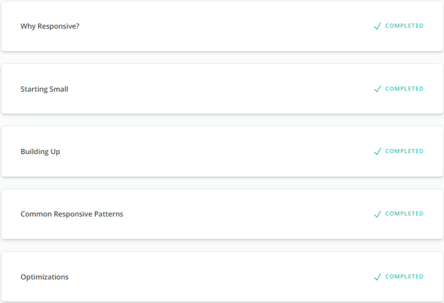
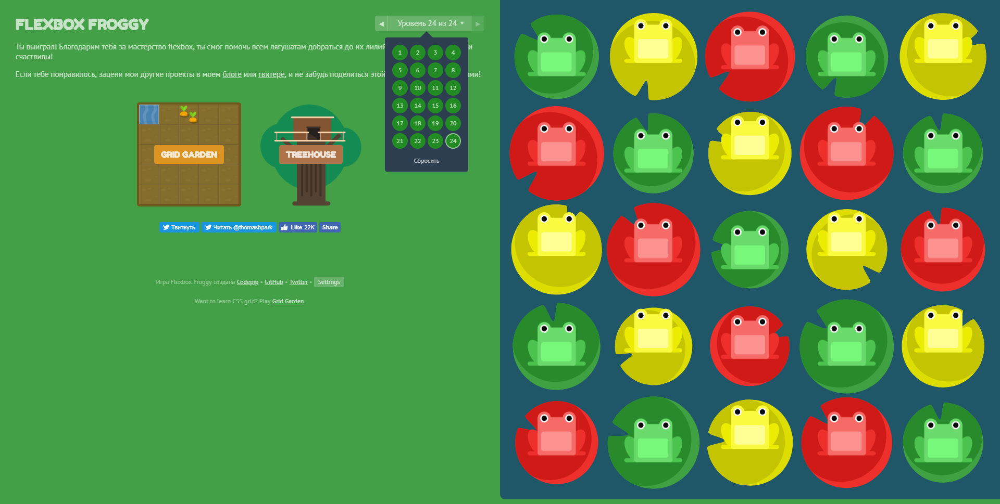
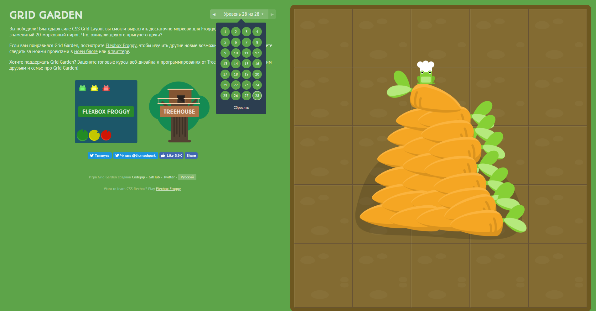

## Responsive Web Design
Its very interesting task for expanding your knowledge in responsive web design. The games about flex and grid are amazing. All changes which you doing in CCS file carefully with animation pained in the browser. 
* [Responsive Web Design Fundamentals](https://classroom.udacity.com/courses/ud89)

* [Flexbox Froggy](http://flexboxfroggy.com)

* [Flexbox Froggy](http://cssgridgarden.com)

[back](../README.md)
