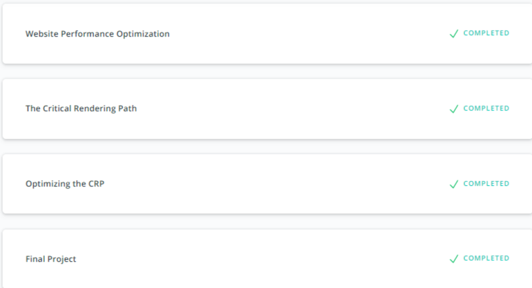

## Website Performance Optimization
I found out about async, media, viewport height and width (vh/vw), calc(), srcset,

* [Website Performance Optimization](https://classroom.udacity.com/courses/ud884)

* [Responsive Images](https://classroom.udacity.com/courses/ud882)

[back](../README.md)
